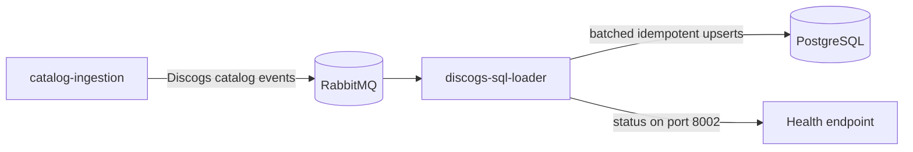

# GrooveMap Discogs SQL loader

`discogs-sql-loader` consumes normalized Discogs catalog events and maintains the
PostgreSQL copy of GrooveMap's Discogs catalog. It owns the artists, labels, masters,
and releases tables used for structured queries and downstream enrichment.



The loader accepts the versioned `groovemap.catalog-events` contract on four durable
fanout exchanges: `groovemap-discogs-artists`, `groovemap-discogs-labels`,
`groovemap-discogs-masters`, and `groovemap-discogs-releases`. Normal records become
JSONB rows keyed by Discogs ID. Terminal `file_complete` and `extraction_complete`
messages drain pending writes before completion or stale-row cleanup is acknowledged.

## Run and validate

Install the pinned toolchain and dependencies, then run the credential-free checks:

```bash
mise install
just setup
just check
```

Run the service locally with `uv run discogs-sql-loader`. PostgreSQL and RabbitMQ are
external dependencies; use the separately versioned
[`deployment`](https://github.com/groovemap-music/deployment) repository for the full
stack. Build and inspect the repository-owned image with `just image`. The published
image name is `ghcr.io/groovemap-music/discogs-sql-loader`.

`just check` formats and lints the source, verifies promoted contracts, scans for
secrets, type-checks, runs the mocked unit and regression suite with coverage, builds
and installs the wheel, checks licenses, and previews the next version. Tests do not
connect to live PostgreSQL or RabbitMQ services.

## Operational behavior

- Batch mode is on by default. Messages are acknowledged only after their PostgreSQL
  transaction commits.
- On a transient PostgreSQL outage, messages remain recoverable and retry with bounded
  backoff rather than consuming the dead-letter budget.
- Shutdown first cancels consumers, then flushes accepted batches, and finally closes
  RabbitMQ and PostgreSQL connections.
- After `file_complete`, the matching consumer drains and may be canceled after a grace
  period. After `extraction_complete`, all remaining batches drain before guarded
  stale-row cleanup.
- Restart does not persist in-memory completion state. The producer may resume an
  extraction, and the large-delete guard prevents a resumed run from purging an
  almost-complete table.
- A record whose hash is unchanged normally refreshes only `updated_at`. The one
  exception is a `releases` row left with a NULL `media` column by a loader that predates
  the canonical media taxonomy: the batch path derives the block and writes that column
  in place. On an upgraded stack, a `force_reprocess` run therefore backfills `media`
  across the existing catalog without rewriting payloads that have not changed. Those
  rows are counted and logged as `media_backfilled` rather than `skipped`.

See [Operations](docs/operations.md) for configuration, input and output details,
completion semantics, health states, and troubleshooting. The
[documentation index](docs/README.md) links the focused resilience, performance, and
schema references.

## Contracts and compatibility

The catalog-event contract is promoted from `catalog-ingestion`; persistence
compatibility is promoted from `database-schema`. `just source-check` verifies both
boundaries and their generated binding.

The repository name, image, executable, health identity, logs, and startup banner use
`discogs-sql-loader`. A small set of pre-split identifiers remains intentionally stable
for imports and durable AMQP queue names; see
[Compatibility identifiers](docs/compatibility.md).

## License

The current tree is available under the [MIT License](LICENSE). Historical revisions
retain their then-applicable license.
