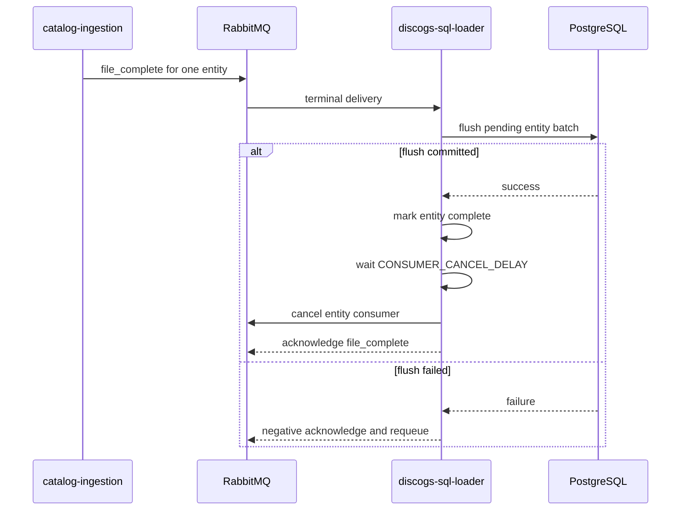

# Consumer cancellation and draining

`discogs-sql-loader` cancels a RabbitMQ consumer only after the producer signals that
its entity file is complete and the loader has drained that entity's accepted batch.



## Configuration

`CONSUMER_CANCEL_DELAY` is the grace period in seconds. The default is `300`; `0`
disables cancellation. Duplicate completion messages do not schedule duplicate tasks,
and cancellation failures are logged without preventing the remaining teardown.

After every entity completes, the service closes its RabbitMQ connection. It reconnects
on the next periodic queue check when new messages are available. The interval is
controlled by `QUEUE_CHECK_INTERVAL` and defaults to one hour.

## Shutdown ordering

Process shutdown has a separate but related ordering guarantee:

1. cancel every active consumer so no new deliveries arrive;
2. stop periodic tasks;
3. flush all messages already accepted by the batch processor;
4. close RabbitMQ and PostgreSQL resources.

Leaving shutdown deliveries unsettled allows the broker connection close to requeue
them once. A historical regression test exercises repeated delivery churn and verifies
that teardown never acknowledges or negative-acknowledges those late messages.

Run the focused coverage with:

```bash
uv run pytest tests/test_file_completion.py tests/test_shutdown_delivery_churn.py -q
```
