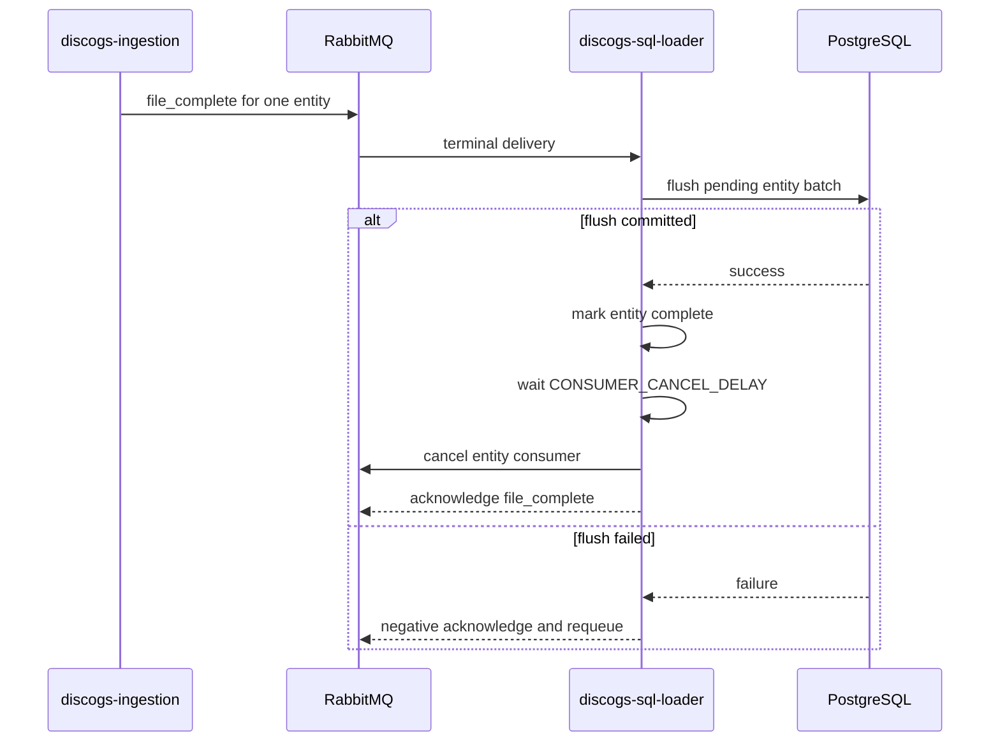

# Consumer cancellation and draining

`discogs-sql-loader` cancels a RabbitMQ consumer only after the producer signals that
its entity file is complete and the loader has drained that entity's accepted batch.


```mermaid
sequenceDiagram
    participant I as discogs-ingestion
    participant R as RabbitMQ
    participant L as discogs-sql-loader
    participant P as PostgreSQL

    I->>R: file_complete for one entity
    R->>L: terminal delivery
    L->>P: flush pending entity batch
    alt flush committed
        P-->>L: success
        L->>L: mark entity complete
        L->>L: wait CONSUMER_CANCEL_DELAY
        L->>R: cancel entity consumer
        L-->>R: acknowledge file_complete
    else flush failed
        P-->>L: failure
        L-->>R: negative acknowledge and requeue
    end
```

## Configuration

`CONSUMER_CANCEL_DELAY` is the grace period in seconds. The default is `300`; `0`
disables cancellation. Duplicate completion messages do not schedule duplicate tasks,
and cancellation failures are logged without preventing the remaining teardown.

Every cancellation waits for broker `cancel-ok` (`nowait=False`) with a five-second
RPC and task deadline. A type stays in `consumer_tags` until confirmation; missing
queue handles and timeouts retain the uncertain tag and mark health unhealthy.
The periodic checker then closes the uncertain delivery channel with a bounded
wait and only resubscribes after closure is confirmed. Durable pause/resubscribe
cancellations use the same deadlines.

Shutdown first cancels and joins pending grace timers. It stops attempting RPCs
on the first failed cancel and closes the uncertain channel before batch teardown,
so a broken channel cannot spend one full timeout for every remaining subscriber.
A new data record resets its type's completion marker and cancels the previous
run's grace timer. Timer cleanup removes only its own reference, so a canceled old
timer cannot erase a replacement timer. Recovery also resets completion for types
with pending messages; initially empty types reset when their first record arrives.

After every entity completes, the service closes its RabbitMQ connection. It reconnects
on the next periodic queue check when new messages are available. The interval is
controlled by `QUEUE_CHECK_INTERVAL` and defaults to one hour.

## Shutdown ordering

Process shutdown has a separate but related ordering guarantee:

1. cancel every active consumer so no new deliveries arrive;
2. stop periodic tasks;
3. flush all messages already accepted by the batch processor;
4. close RabbitMQ and PostgreSQL resources.

Leaving shutdown deliveries unsettled allows the broker connection close to requeue
them once. A historical regression test exercises repeated delivery churn and verifies
that teardown never acknowledges or negative-acknowledges those late messages.

Run the focused coverage with:

```bash
uv run pytest tests/test_consumer_cancellation.py tests/test_file_completion.py tests/test_shutdown_delivery_churn.py -q
```
