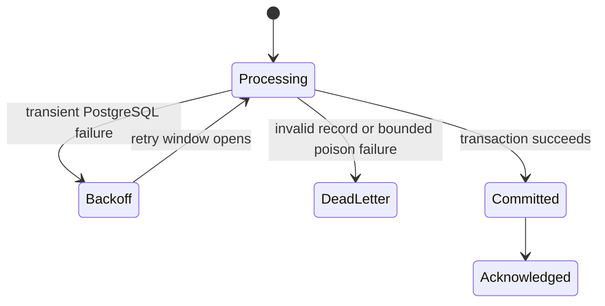

# Database resilience

`discogs-sql-loader` is designed to keep accepted catalog deliveries recoverable during
temporary PostgreSQL outages.



## PostgreSQL boundary

The shared runtime maintains an asynchronous connection pool with health checks and
bounded retry behavior. The default pool range is 2–12 connections and can be changed
with `POSTGRES_POOL_MIN_SIZE` and `POSTGRES_POOL_MAX_SIZE`.

Batch mode limits concurrent flushes independently of the pool. Non-batch mode uses
channel-global RabbitMQ prefetch no larger than the configured pool maximum so delivery
handlers cannot exhaust the pool while holding hundreds of unacknowledged messages.

## Delivery settlement

- A successful transaction commits before its messages are acknowledged.
- Interface, operational, and unavailable-database failures re-enqueue with backoff.
- Transient failures do not increment the poison-data counter, so an outage cannot
  dead-letter otherwise valid records.
- Invalid records and bounded poison batches use the consumer's dead-letter queue.
- Stale-row cleanup is skipped for an entity that dead-lettered a record during the
  current extraction.

## Recovery checks

The health endpoint at `http://localhost:8002/health` reports `starting` while the pool
is not initialized, `healthy` when the pool and consumers are usable, and `unhealthy`
when the pool is lost or the service detects an unexpected no-consumer state. The
periodic checker reconnects RabbitMQ and recreates consumers when work returns.

The complete mocked resilience suite runs under `just check`. To focus on the prior
pool-exhaustion and transient-classification regressions:

```bash
uv run pytest tests/test_tableinator.py tests/test_batch_processor.py -k 'pool or transient or outage' -q
```
