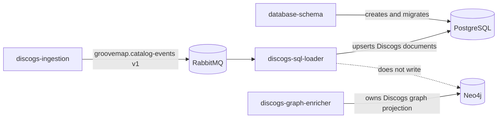

# PostgreSQL persistence boundary

`discogs-sql-loader` writes normalized Discogs catalog records to PostgreSQL. It
does not create or migrate database objects. The
[`database-schema`](https://github.com/groovemap-music/database-schema) repository
owns the executable PostgreSQL and Neo4j definitions, their compatibility contract,
and the initializer image. Deployment must apply that contract before starting this
consumer.

## Tables this service writes

The loader accepts only the four entity names in its promoted Discogs event contract.
Each name maps directly to one public PostgreSQL table:

| Table | Key supplied by the event | Columns maintained by this service |
| --- | --- | --- |
| `artists` | Discogs artist ID | `hash`, `data_id`, `data`, `updated_at` |
| `labels` | Discogs label ID | `hash`, `data_id`, `data`, `updated_at` |
| `masters` | Discogs master ID | `hash`, `data_id`, `data`, `updated_at` |
| `releases` | Discogs release ID | `hash`, `data_id`, `data`, `media`, `updated_at` |

`data` preserves the complete normalized event payload as JSONB. `hash` is the
producer-supplied SHA-256 value used to avoid rewriting an unchanged document.
`updated_at` is refreshed for every accepted catalog record so terminal cleanup can
distinguish rows observed during the current extraction.

For `releases`, `media` is the separately queryable canonical media block. The loader
uses an event's canonical block when present and derives a compatibility value from
legacy Discogs `formats` otherwise. A hash-unchanged row created before the column was
introduced receives a media-only backfill; its `hash` and `data` remain unchanged.
The media shape is owned by
[ADR 0007](https://github.com/groovemap-music/design/blob/main/docs/adr/0007-canonical-media-taxonomy.md),
while the column and index remain owned by `database-schema`.

## Write and cleanup invariants

- `data_id` is the conflict key for idempotent upserts.
- Batch mode writes each entity batch in one PostgreSQL transaction and acknowledges
  its deliveries only after commit.
- Non-batch mode preserves the same hash-gated update and media-backfill behavior.
- `file_complete` drains the pending batch for its entity before acknowledgement.
- `extraction_complete` can delete rows whose `updated_at` predates the extraction,
  but only when no record for that entity was dead-lettered and the configured
  large-delete guard permits the cleanup.
- Identifiers are rendered through Psycopg's SQL identifier API and are limited to
  `artists`, `labels`, `masters`, and `releases` by the promoted contract.

See [Operations](operations.md) for runtime configuration and completion handling and
[Database resilience](database-resilience.md) for retry and delivery-settlement rules.

## Authoritative definitions

Use the owning repositories instead of copying their schemas here:

- [PostgreSQL definitions and indexes](https://github.com/groovemap-music/database-schema/blob/main/src/groovemap_schema/postgres.py)
- [Persistence compatibility contract](https://github.com/groovemap-music/database-schema/tree/main/contracts/persistence)
- [Discogs graph model and projection](https://github.com/groovemap-music/discogs-graph-enricher)
- [Deployment ordering and database operations](https://github.com/groovemap-music/deployment)

Changes to a table, column, constraint, or index begin in `database-schema`. Changes
to Neo4j nodes, relationships, or Cypher projection begin in
`discogs-graph-enricher`. This repository changes only the Discogs-to-PostgreSQL write
behavior against a promoted persistence contract.
