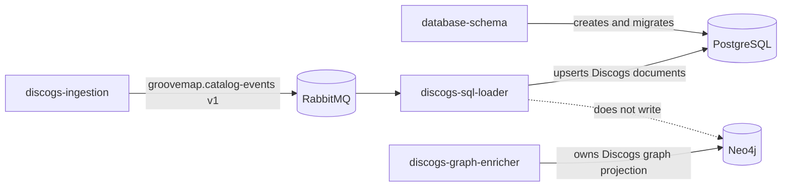

# PostgreSQL persistence boundary

`discogs-sql-loader` writes normalized Discogs catalog records to PostgreSQL. It
does not create or migrate database objects. The
[`database-schema`](https://github.com/groovemap-music/database-schema) repository
owns the executable PostgreSQL and Neo4j definitions, their compatibility contract,
and the initializer image. Deployment must apply that contract before starting this
consumer.

## Tables this service writes

The loader accepts only the four entity names in its promoted Discogs event contract.
Each name maps directly to one public PostgreSQL table:

| Table | Key supplied by the event | Columns maintained by this service |
| --- | --- | --- |
| `artists` | Discogs artist ID | `hash`, `data_id`, `data`, `gm_item_id`, `updated_at` |
| `labels` | Discogs label ID | `hash`, `data_id`, `data`, `gm_item_id`, `updated_at` |
| `masters` | Discogs master ID | `hash`, `data_id`, `data`, `gm_item_id`, `updated_at` |
| `releases` | Discogs release ID | `hash`, `data_id`, `data`, `media`, `gm_item_id`, `updated_at` |

`data` preserves the complete normalized event payload as JSONB. `hash` is the
producer-supplied SHA-256 value used to avoid rewriting an unchanged document.
`updated_at` is refreshed for every accepted catalog record so terminal cleanup can
distinguish rows observed during the current extraction.

For `releases`, `media` is the separately queryable canonical media block. The loader
uses an event's canonical block when present and derives a compatibility value from
legacy Discogs `formats` otherwise. A hash-unchanged row created before the column was
introduced receives a media-only backfill; its `hash` and `data` remain unchanged.
The media shape is owned by
[ADR 0007](https://github.com/groovemap-music/design/blob/main/docs/adr/0007-canonical-media-taxonomy.md),
while the column and index remain owned by `database-schema`.

## Native identity

`gm_item_id` is the GrooveMap catalog item the row's Discogs identifier maps to. The
Discogs `data_id` remains the primary key and the conflict target; `gm_item_id` is an
additive nullable column beside it, so a provider identifier is evidence rather than
identity ([ADR 0009](https://github.com/groovemap-music/design/blob/main/docs/adr/0009-native-identity.md)).

The minting rule:

- The loader resolves `(discogs, <entity kind>, data_id)` through
  `common.identity.resolve_aliases`, which looks the alias up and mints a `catalog_items`
  row and a `provider_aliases` row for a miss. The entity kind is the singular table
  name: `artist`, `label`, `master`, `release`.
- Batch mode resolves the whole batch in one call, on the batch's own connection and
  inside the batch's transaction, before any write. A batch is therefore either fully
  identified or rolled back whole, and a Discogs identifier the resolve does not answer
  fails the batch rather than writing an unidentified row.
- Every upsert, batch and non-batch, writes `gm_item_id` on insert and on conflict.
- A hash-unchanged row whose `gm_item_id` is still NULL predates minting. It receives an
  identity-only backfill in the same transaction, the way a NULL `media` column is
  backfilled; its `hash` and `data` remain unchanged. An unchanged row that already
  carries a `gm_item_id` is left alone.

The table, the column, and its index remain owned by `database-schema`; the alias tables
`catalog_items` and `provider_aliases` are owned there too and read through the shared
`groovemap-runtime` implementation rather than any SQL in this repository.

## Identifier aliases

A release event carries a canonical `identifiers` block beside its `data`
([ADR 0011](https://github.com/groovemap-music/design/blob/main/docs/adr/0011-catalog-identifiers-and-manufacturing-credits.md)).
The block is persisted verbatim inside `data`, and its alias-bearing identifiers also
become `provider_aliases` rows on the release's `gm_item_id`, so a lookup by a printed
barcode or catalogue number resolves to the same catalog item as the Discogs release id.

The minting rule:

- `common.identifiers.alias_refs_for_release` reads the block and returns one alias per
  alias-bearing identifier: `barcode` normalized to its digits, `catalog_number`
  upper-cased with whitespace collapsed, and `matrix` with its case preserved, because
  the characters stamped into the disc are the evidence. Every other identifier type is
  carried on the block and mints nothing.
- The loader calls `common.identity.attach_aliases` once per batch, on the batch's own
  connection and inside the batch's transaction after the upsert, so the aliases and the
  rows they point at commit or roll back together. Non-batch mode makes the same call per
  record on the connection that performed its upsert.
- Hash-unchanged rows attach too. The existing-rows SELECT reads the entity table and
  cannot see whether a row's aliases were ever written, and attaching is idempotent, so a
  row skipped by hash is attached rather than assumed complete.
- The block is additive within catalog-events v1. A release produced before it existed,
  or one whose block carries no alias-bearing identifier, attaches nothing and still
  loads.
- `attach_aliases` never overwrites an alias that is already present: it returns the
  native id the existing alias points at. When that id differs from the release's own, two
  items print one value; the batch counts the collision, logs it with the entity type and
  the alias count, and commits. It is never raised, because failing the batch would strand
  every other row over a duplicate barcode.
- A block that does not match the promoted contract is rejected by the shared validator.
  That is a producer defect, and the `ValueError` it raises is classified as a
  deterministic failure, so the batch is dead-lettered rather than retried as an outage.

## Write and cleanup invariants

- `data_id` is the conflict key for idempotent upserts.
- Batch mode writes each entity batch in one PostgreSQL transaction and acknowledges
  its deliveries only after commit.
- Non-batch mode preserves the same hash-gated update, media-backfill, native-identity,
  and identifier-alias behavior, resolving and attaching its aliases on the connection
  that performs the upsert.
- `file_complete` drains the pending batch for its entity before acknowledgement.
- `extraction_complete` can delete rows whose `updated_at` predates the extraction,
  but only when no record for that entity was dead-lettered and the configured
  large-delete guard permits the cleanup.
- Identifiers are rendered through Psycopg's SQL identifier API and are limited to
  `artists`, `labels`, `masters`, and `releases` by the promoted contract.

See [Operations](operations.md) for runtime configuration and completion handling and
[Database resilience](database-resilience.md) for retry and delivery-settlement rules.

## Authoritative definitions

Use the owning repositories instead of copying their schemas here:

- [PostgreSQL definitions and indexes](https://github.com/groovemap-music/database-schema/blob/main/src/groovemap_schema/postgres.py)
- [Persistence compatibility contract](https://github.com/groovemap-music/database-schema/tree/main/contracts/persistence)
- [Discogs graph model and projection](https://github.com/groovemap-music/discogs-graph-enricher)
- [Deployment ordering and database operations](https://github.com/groovemap-music/deployment)

Changes to a table, column, constraint, or index begin in `database-schema`. Changes
to Neo4j nodes, relationships, or Cypher projection begin in
`discogs-graph-enricher`. This repository changes only the Discogs-to-PostgreSQL write
behavior against a promoted persistence contract.
