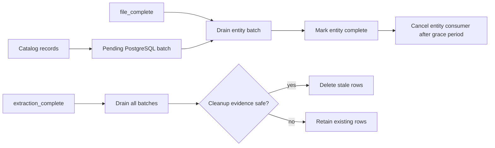

# File completion tracking

The Discogs catalog stream carries two terminal message types. They are persistence
barriers, not informational notifications.



## `file_complete`

The message identifies one of `artists`, `labels`, `masters`, or `releases`. In batch
mode, `discogs-sql-loader` flushes that entity before adding it to `completed_files` and
acknowledging the delivery. A failed flush requeues the marker without recording false
completion.

## `extraction_complete`

The message includes the extraction version, timestamp, `started_at`, and per-entity
record counts. The loader flushes all pending work, then considers stale-row cleanup for
the matching table. Cleanup does not run when a record was dead-lettered during this
extraction or when the proposed deletion reaches the configured large-delete fraction.

## Restart behavior

`completed_files` is process-local. After restart, the producer can resume an extraction
and omit files it completed earlier. Those tables may receive a terminal extraction
signal without receiving records in the new process. `PURGE_MAX_DELETE_FRACTION`
(default `0.90`) prevents that resumed state from deleting nearly all previously loaded
rows.

Use the health endpoint's `completed_files`, `active_consumers`, `message_counts`, and
`current_task` fields to observe progress. The focused terminal-delivery tests are:

```bash
uv run pytest tests/test_file_completion.py -q
uv run pytest tests/test_tableinator.py -k 'file_complete or extraction_complete' -q
```
