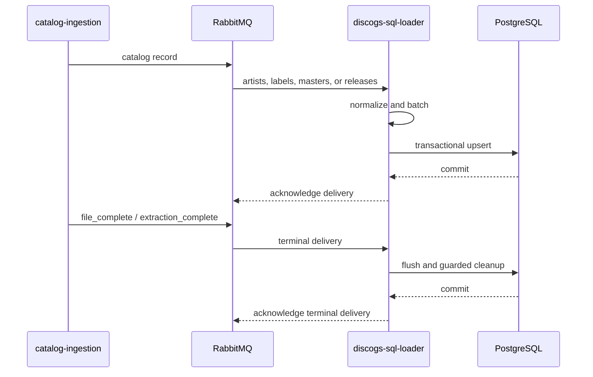

# Operations

## Data flow



The input contract is `groovemap.catalog-events` version 1. The default Discogs
exchange prefix is `groovemap-discogs`, producing one durable fanout exchange for each
supported entity: `artists`, `labels`, `masters`, and `releases`.

Normal messages require a non-empty `id`. Their source hash and normalized payload are
upserted into the matching PostgreSQL table:

| Table | Primary key | Stored data |
| --- | --- | --- |
| `artists` | Discogs artist ID | source hash and normalized JSONB record |
| `labels` | Discogs label ID | source hash and normalized JSONB record |
| `masters` | Discogs master ID | source hash and normalized JSONB record |
| `releases` | Discogs release ID | source hash and normalized JSONB record |

## Configuration

Credentials support either the named variable or its `_FILE` form. Secret files are
preferred for deployed containers.

| Variable | Required/default | Purpose |
| --- | --- | --- |
| `POSTGRES_HOST` | required; may include a port | PostgreSQL or PgBouncer address |
| `POSTGRES_PORT` | `5432` | Port when `POSTGRES_HOST` does not include one |
| `POSTGRES_USERNAME` / `_FILE` | required | PostgreSQL user |
| `POSTGRES_PASSWORD` / `_FILE` | required | PostgreSQL password |
| `POSTGRES_DATABASE` | required | PostgreSQL database |
| `POSTGRES_POOL_MIN_SIZE` | `2` | Minimum open PostgreSQL connections |
| `POSTGRES_POOL_MAX_SIZE` | `12` | Maximum open PostgreSQL connections |
| `RABBITMQ_HOST` | `rabbitmq` | RabbitMQ host |
| `RABBITMQ_PORT` | `5672` | RabbitMQ AMQP port |
| `RABBITMQ_USERNAME` / `_FILE` | deployment supplied | RabbitMQ user |
| `RABBITMQ_PASSWORD` / `_FILE` | deployment supplied | RabbitMQ password |
| `DISCOGS_EXCHANGE_PREFIX` | `groovemap-discogs` | Producer-owned exchange prefix |
| `POSTGRES_BATCH_MODE` | `true` | Enable transactional batch writes |
| `POSTGRES_BATCH_SIZE` | `100` | Records that trigger a batch flush |
| `POSTGRES_BATCH_FLUSH_INTERVAL` | `5.0` seconds | Time that triggers a batch flush |
| `CONSUMER_CANCEL_DELAY` | `300` seconds | Grace period after `file_complete`; `0` disables cancellation |
| `QUEUE_CHECK_INTERVAL` | `3600` seconds | Poll interval after all queues become idle |
| `STUCK_CHECK_INTERVAL` | `30` seconds | Consumer recovery check interval |
| `STARTUP_IDLE_TIMEOUT` | `30` seconds | Delay before entering quiet idle mode |
| `IDLE_LOG_INTERVAL` | `300` seconds | Idle progress-log interval |
| `STARTUP_DELAY` | `5` seconds | Delay before dependency initialization |
| `PURGE_MAX_DELETE_FRACTION` | `0.90` | Refuse cleanup at or above this fraction |

## Completion and restart behavior

A `file_complete` delivery is not acknowledged until the batch for that entity has
flushed successfully. The service then marks the entity complete and, after
`CONSUMER_CANCEL_DELAY`, cancels that consumer. When all consumers are complete, the
RabbitMQ connection can close; `QUEUE_CHECK_INTERVAL` controls when the service checks
for new work and reconnects.

An `extraction_complete` delivery flushes all pending data before guarded stale-row
cleanup. Cleanup is skipped when a message for that entity was dead-lettered or when
the deletion would meet or exceed `PURGE_MAX_DELETE_FRACTION` of a non-empty table.

Completion state is in memory. On process restart, the producer may resume and skip
files completed earlier. The delete guard is therefore part of the restart-safety
contract. During shutdown, consumers are canceled before the potentially slow batch
flush so RabbitMQ does not keep delivering messages that the process cannot settle.

## Health and logs

The health server listens on port `8002`. Its JSON identifies the service as
`discogs-sql-loader` and reports `starting`, `healthy`, or `unhealthy`, plus the current
task, per-entity counts, active consumers, and completed files. Container logs are
written through the shared structured-logging runtime under the same service name.

## Validation

```bash
just check
```

The check is local and credential-free after dependencies are installed. It covers the
restored shutdown-delivery, terminal file-completion, batch-performance, drain, and
transient-failure regressions without contacting PostgreSQL or RabbitMQ.

For container validation, run `just image`; this builds `discogs-sql-loader:local`,
checks the installed module, and verifies the non-root runtime identity. The full stack
belongs to the separate `deployment` repository.

## Troubleshooting

- `starting` persists: verify all required PostgreSQL variables and reachability.
- `unhealthy` with no consumers: inspect RabbitMQ connectivity and stuck-state logs.
- Terminal delivery is requeued: the pending batch did not commit; inspect PostgreSQL
  availability before retrying.
- Cleanup was refused: confirm whether the producer resumed an existing extraction or
  whether the source dump unexpectedly shrank before changing the safety threshold.
