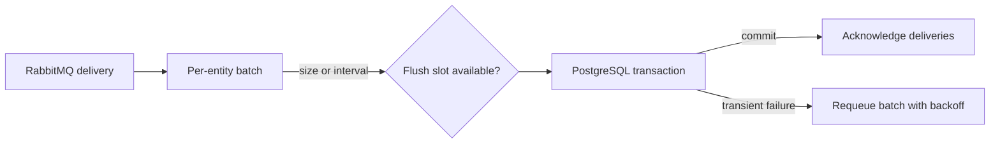

# Discogs SQL loader performance

Performance work in this repository is limited to consuming Discogs deliveries and
committing them to PostgreSQL. API latency, Cypher planning, Neo4j sizing, shared
PgBouncer capacity, and host tuning are owned elsewhere.

## Current write path

Batch mode is enabled by default. Each entity has an in-memory queue; reaching
`POSTGRES_BATCH_SIZE` or `POSTGRES_BATCH_FLUSH_INTERVAL` starts a transactional bulk
upsert. At most two batch flushes acquire PostgreSQL connections concurrently. An
acknowledgement occurs only after the transaction commits.



| Setting | Default | Local effect |
| --- | --- | --- |
| `POSTGRES_BATCH_MODE` | `true` | Enables transactional batches instead of one upsert per delivery. |
| `POSTGRES_BATCH_SIZE` | `100` | Records that trigger a batch flush; batch-mode prefetch remains at least twice this value. |
| `POSTGRES_BATCH_FLUSH_INTERVAL` | `5.0` seconds | Bounds the wait for a partially filled batch. |
| `POSTGRES_POOL_MIN_SIZE` | `2` | Keeps a small ready connection floor. |
| `POSTGRES_POOL_MAX_SIZE` | `12` | Bounds this service's PostgreSQL connections. |

In non-batch mode, channel-global RabbitMQ prefetch equals the configured pool maximum.
This applies backpressure at the broker rather than allowing delivery handlers to wait
unboundedly for a database connection. In batch mode, prefetch is per consumer because
handlers enqueue records without holding connections; the flush semaphore provides the
database bound.

## Tuning and evidence

Start from the defaults and change one value at a time. Measure batch size, flush
duration, message outcomes, PostgreSQL wait time, and RabbitMQ backlog over a complete
representative extraction. Larger batches trade memory and acknowledgement latency for
fewer database round trips; a shorter interval lowers partial-batch latency but creates
more transactions.

Run the local regression gate after changing write coordination:

```bash
uv run pytest tests/test_batch_processor.py tests/test_tableinator.py -q
just check
```

The tests use fakes and mocks rather than a live RabbitMQ or PostgreSQL service. End-to-end
capacity validation belongs to the released stack in the
[`deployment`](https://github.com/groovemap-music/deployment) repository.

## Other performance owners

- PostgreSQL and Neo4j indexes: [`database-schema`](https://github.com/groovemap-music/database-schema)
- Catalog API SQL and Cypher queries: [`catalog-api`](https://github.com/groovemap-music/catalog-api/blob/main/docs/query-performance-optimizations.md)
- Discogs graph writes and graph projection: [`discogs-graph-enricher`](https://github.com/groovemap-music/discogs-graph-enricher)
- Shared pool, broker, and telemetry implementations: [`python-libraries`](https://github.com/groovemap-music/python-libraries)
- Stack sizing and observability: [`deployment`](https://github.com/groovemap-music/deployment)
