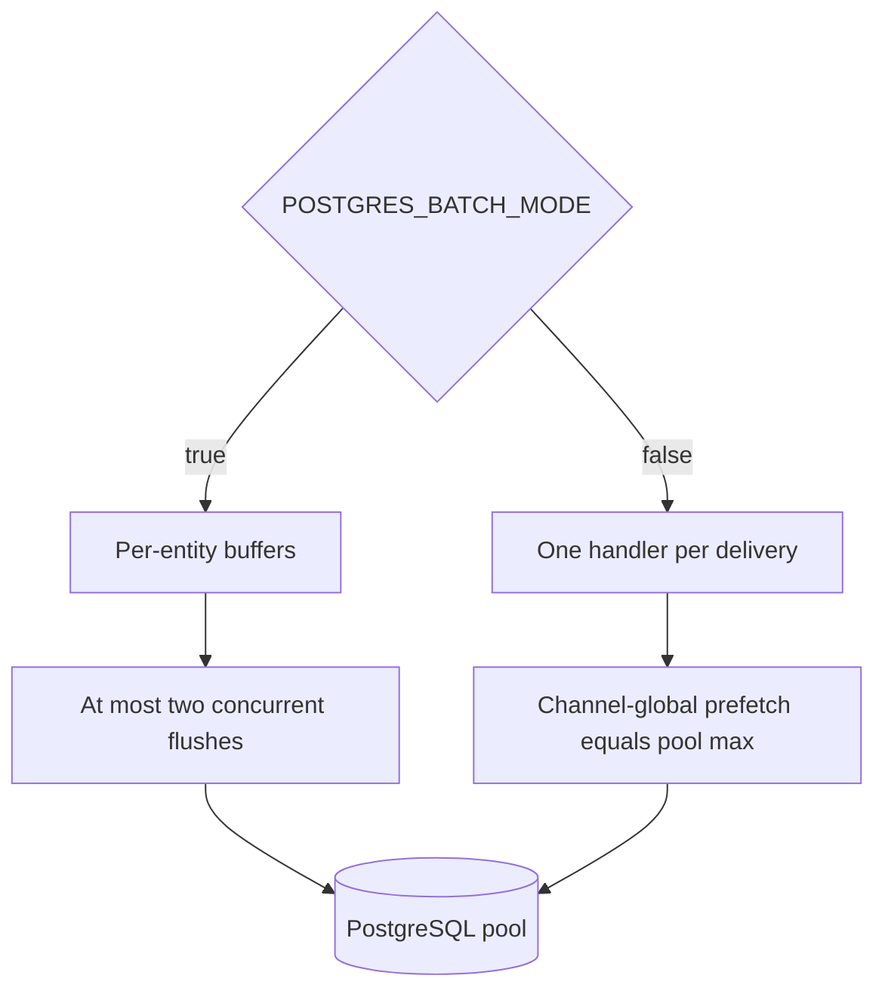

# PostgreSQL pool protection

This repository once carried a system-wide pool-exhaustion incident report covering
several services and deployment limits. Those fleet-level values age independently of
this consumer and now belong to the
[`deployment`](https://github.com/groovemap-music/deployment) repository.

The retained `discogs-sql-loader` conclusion is simple: the broker must not create more
simultaneous connection demand than this service's pool can satisfy.

## Enforced behavior

- The PostgreSQL pool defaults to 2–12 connections and is configured with
  `POSTGRES_POOL_MIN_SIZE` and `POSTGRES_POOL_MAX_SIZE`.
- Batch mode queues deliveries in memory and limits concurrent flushes to two. Its
  RabbitMQ prefetch is per consumer and large enough to fill each entity batch.
- Non-batch mode performs one database operation per in-flight handler. Its prefetch is
  channel-global and equals `POSTGRES_POOL_MAX_SIZE`, so RabbitMQ supplies the
  backpressure.
- Pool acquisition, transaction, and retry behavior comes from the pinned
  `groovemap-runtime`; this repository does not maintain a second pool implementation.

Use [Database resilience](database-resilience.md) for settlement and retry behavior and
[Discogs SQL loader performance](performance-guide.md) for tuning. Shared PgBouncer
budgets, other services' pool sizes, and production capacity decisions must be verified
against the current deployment configuration rather than copied into this repository.
