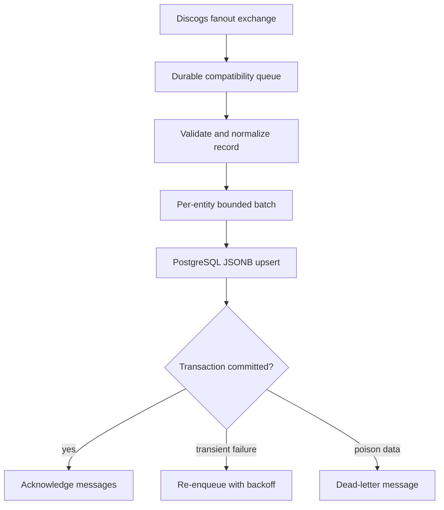

# `discogs-sql-loader` implementation

The `tableinator` Python package contains the implementation behind the public
`discogs-sql-loader` console command. The package name is retained for import
compatibility; it is not the service's runtime identity.

## Processing boundary



The loader consumes `artists`, `labels`, `masters`, and `releases`. Every entity table
uses `data_id` as its primary key and stores a source hash plus the normalized record in
JSONB. Upserts skip unchanged hashes and update changed records atomically.

`file_complete` drains the entity's pending batch before marking it complete.
`extraction_complete` drains all batches, then deletes rows older than the extraction's
`started_at` only when the completion evidence is safe. A configurable large-delete
guard refuses suspicious cleanup after a resumed extraction.

## Entry points

- Console command: `uv run discogs-sql-loader`
- Python: 3.14
- Python entry point: `tableinator.tableinator:cli`
- Health endpoint: `http://localhost:8002/health`
- Local image: `discogs-sql-loader:local`
- Published image: `ghcr.io/groovemap-music/discogs-sql-loader`

For environment variables and lifecycle behavior, see
[Operations](../docs/operations.md). For the intentionally retained package and AMQP
identifiers, see [Compatibility identifiers](../docs/compatibility.md).

## Tests

Run `just check` from the repository root. Focused commands are available when
diagnosing a failure:

```bash
just test
uv run pytest tests/test_file_completion.py -q
uv run pytest tests/test_shutdown_delivery_churn.py -q
uv run pytest tests/test_batch_performance.py -q
```

These tests use mocked persistence and broker boundaries; they do not require live
infrastructure.
